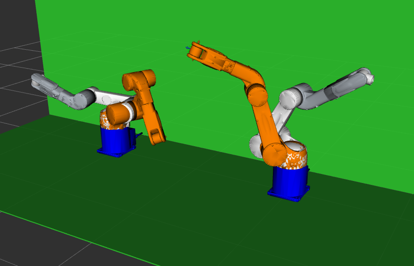

# Denso VM-60B1 Dual-Arm ROS 2 + MoveIt2

This package provides ROS 2 launch files, URDF models, and Python scripts for controlling a **dual-arm Denso VM-60B1 industrial robot system** in both **simulation** and **real hardware** modes using MoveIt2.  
It supports **coordinated dual-arm planning**, **waypoint-based motion execution**, and **URDF/Xacro-based robot descriptions**.

This work is based on the official [Denso Robotics ROS2 repository](https://github.com/DENSORobot/denso_robot_ros2) with significant modifications for:
- Added support for VM-60B1 robot model
- Dual-arm robot configuration
- CSV waypoint trajectory execution
- Coordinated `dual_arm` MoveIt2 planning group
- Additional utilities for testing and simulation

---

## Features
- **Unified Dual-Arm MoveIt2 Control**: Both arms can be planned/executed together or individually.
- **Waypoint Execution**: Load joint-space or cartesian waypoints from CSV files.
- **Box Lifting**: Spawn boxes and other objects in simulation for Gazebo, lift boxes in sim or with real hardware.
- **Simulation & Real Hardware Modes**: Easily switch via a launch argument.
- **Custom URDF/Xacro**: Full kinematic chain for two 6-DOF arms.

---

## Download & Installation

### 1. Clone the repository into your ROS 2 workspace
```bash
cd ~/ros2_ws/src
git clone https://github.com/clarkdimitrios/denso_manipulation.git
```

### 2. Clone the forked repository for Denso Robot ROS 2 packages
Follow the Installation instructions [here](https://github.com/clarkdimitrios/denso_robot_ros2.git).

### 3. Install dependencies
```bash
sudo apt update
sudo apt install ros-humble-moveit ros-humble-gazebo-ros-pkgs
pip install pymoveit2

cd ~/ros2_ws/src
git clone https://github.com/IFRA-Cranfield/IFRA_LinkAttacher.git
```

### 4. Build the package
```bash
cd ~/ros2_ws
colcon build
source install/setup.bash
```

---

## Usage

### Dual-Arm Setup
- To specify the inter-arm distance (in meters), edit the `right_arm_x` parameter value in `config/scene_config.xacro`.
- In the same file, the pose, size, and mass of objects spawned in Gazebo can be specified. Make sure to reflect real objects.

### Simulation Mode
To launch the dual-arm robot in **RViz** and **Gazebo**:
```bash
ros2 launch dual_denso_arm_manipulation comb_multi_robot_bringup.launch.py sim:=true
```



---

### Real Hardware Mode
1. Connect both RC8A controllers and your PC to the same Ethernet switch.
2. Set IP addresses:
   - Right arm: `192.168.17.20`
   - Left arm: `192.168.17.21`
   - PC: `192.168.17.100/24` (on the same subnet, setting your PC's address as Executable Token using the Teach Pendant)
3. Set both controllers to AUTO Mode using the Teach Pendant and its special key.
4. Ensure each controller has a pendantless dummy plug or a teach pendant plugged in to stay in AUTO Mode.
5. Launch:
```bash
ros2 launch dual_denso_arm_manipulation comb_multi_robot_bringup.launch.py
```

### Virtual Walls/Objects
For safety, you can add virtual walls in the robot's workspace by editing `config/virtual_walls.yaml`. This restricts MoveIt2 from planning trajectories colliding with these walls/objects.
Note that controller-level safety areas can also be set using the Teach Pendant or Wincaps III for added safety at a low-level.

#### Notes:
- If the hardware setup is not complete (arm calibration, wire shorts for emergency signals and auto-enable), refer to [DENSO documentation](https://www.densorobotics.com/products/controllers/rc8a-controller/).
- If virtual fences are enabled using the Teach Pendant or Wincaps III, it may restrict operations. Can easily be disabled.
- Recommended: change settings to only allow Manual operation whenever the robot collides or enters restricted areas.

---

### Waypoint Execution from CSV
- The following will try to find `<csv_filename>_left.csv` and `<csv_filename>_right.csv`. If not both exist, falls back to `<csv_filename>.csv` for both.
- Upload all waypoint sequences as `csv` files in the `waypoints` folder.
- Note the `cartesian` launch argument. If `true`, uses cartesian end-effector coordinates, else uses joint space configurations (joint angles in degrees).  
```bash
ros2 launch dual_denso_arm_manipulation dual_waypoints.launch.py cartesian:=true csv_filename:=<csv_filename>.csv
```

**Example CSV format (Joint space):**
```csv
<joint_1>, <joint_2>, <joint_3>, <joint_4>, <joint_5>, <joint_6>
90,120,0,0,0,180 
0,120,-45,-90,0,180
```

**Example CSV format (Cartesian space):**
```csv
<x>, <y>, <z>, <roll>, <pitch>, <yaw>
0.8,-0.5,1.0,0,90,180 
0.8,0,0.75,-30,60,-45
```

---

### Lifting Boxes
1. If using real hardware, make sure `config/scene_config.xacro` correctly reflects the box properties.
2. Launch:
```bash
ros2 launch dual_denso_arm_manipulation lift_box.launch.py lift_height:=<+z translation>
```

#### Note:
Currently only supports 1-D motion along the z-axis.

---

## URDF & Planning Groups
- **Dual-arm group**: `dual_arm`
- **Left arm**: `left_arm`
- **Right arm**: `right_arm`
- End effectors: `left_J6`, `right_J6`

---

## Dependencies
- ROS 2 Humble or later
- [MoveIt2](https://moveit.ai/)
- [pymoveit2](https://github.com/AndrejOrsula/pymoveit2)
- Gazebo (optional for simulation)
- Official [Denso ROS2 drivers](https://github.com/DENSORobot/denso_robot_ros2)

---

## License & Credits
- Original Denso ROS 2 repository: [DENSORobotics/ros2_denso_robot](https://github.com/DENSORobot/denso_robot_ros2)
- Official Denso Robotics documentation: [Denso Robotics RC8A Controller Manual](https://www.densorobotics.com/products/controllers/rc8a-controller/)
- IFRA-Cranfield (2023) [Gazebo-ROS2 Link Attacher](https://github.com/IFRA-Cranfield/IFRA_LinkAttacher)
- Modifications for dual-arm planning and expansions by [Clark Abourjeily](https://github.com/clarkdimitrios).
- License: See [LICENSE](LICENSE).